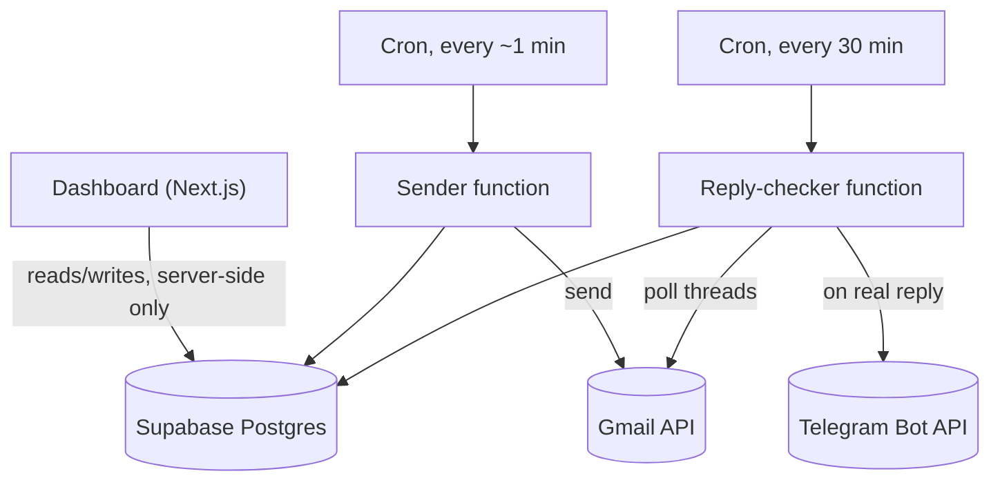

# Cold Outreach Dashboard — Build Plan

## 1. Context

Replaces an n8n-based system (multiple workflows, 200+ nodes) that sends multi-step
email sequences to leads across several inboxes and checks for replies. This document
is a self-contained build plan for a small, single-operator dashboard that replaces it.
It is a plan, not the implementation — no application code is included, only the data
model (which is itself a contract, not an implementation) and enough detail on every
page and function for a developer or coding agent to build each piece unambiguously.

## 2. Decisions & assumptions

Confirmed:
- No login. Single operator, direct access to the dashboard.
- Inboxes connect via Google service account (client email + private key) only — no
  OAuth, no personal Gmail. See §5.
- Every domain used will be one you personally administer on Workspace — no
  client-domain scenario, so service-account-only has no gap to cover.
- Reply detection is periodic polling: every 30 minutes.
- Two independent, per-inbox rules govern sending, and neither is ever overridden by
  campaign, lead count, or queued follow-ups:
  - **Daily limit** (default 30, editable per inbox): once an inbox has sent that many
    today, it simply waits until the next day. No rerouting, no exceptions.
  - **Minimum spacing** (default 3 minutes / 180 seconds, editable per inbox): an
    inbox won't be reused faster than this, regardless of anything else.
- **Equal distribution applies specifically to starting new leads**, not to the
  combined stream of new-lead and follow-up sends. When a new lead needs its first
  email, the sender picks whichever eligible inbox has gone longest without starting a
  new lead — tracked independently of how many follow-ups that inbox has been busy
  sending. Follow-ups always stay on the inbox that already owns that lead's thread;
  there's no "distribution" decision to make for them at all. (This replaces an
  earlier draft of this plan that had all sends system-wide serialized through one
  global timer — that was an overcorrection from an earlier description of the old
  n8n behavior. What actually matters, confirmed against how the n8n sender worked, is
  the daily-limit check per inbox, not a global clock.)
- Bounce handling and do-not-contact are in scope from the start.
- Each import is checked against existing leads so nothing is imported twice.
- Fresh start — no migration from the old Google Sheet.
- Telegram notifications go to any number of registered people, not one fixed chat.
  See §6.
- Emails are always plain text — no HTML, no links.
- Follow-up steps send as replies inside the same Gmail thread.
- Real replies get a second classification pass via Gemini (interested /
  not_interested / out_of_office / wrong_person) before notifying — see the
  companion doc `gemini-reply-classification.md` for the full design,
  schema addition, and code. Section 10 below is superseded by that doc's
  section 8 for the "on a real reply" behavior specifically.

Defaulted (stated for visibility, not separately confirmed):
- Stack: **Next.js** (App Router) + TypeScript + Tailwind, Supabase Postgres + Edge
  Functions — see §3 for why Next.js specifically.
- Moderate scale assumed (a handful of inboxes, low thousands of leads).

## 3. Why Next.js, not a plain SPA

There's no login, so Postgres RLS isn't providing a security boundary — §8 is explicit
that the boundary has to be deployment-level instead. A plain client-side SPA talking
to Supabase directly would need to ship a Supabase key to the browser; Next.js's API
routes / Server Actions let the browser talk only to your own server, which holds the
Supabase service-role key server-side and is never exposed at all. That's a real
security improvement given the no-auth decision, independent of any framework
preference.

## 4. Architecture



The sender function runs frequently (roughly every minute) to stay responsive, but
each inbox's own daily limit and minimum spacing are what actually throttle it — not
the cron interval. See §10.

## 5. Connecting inboxes: service accounts, any domain you control

**Only service accounts, no OAuth.** The personal Gmail inbox from the old system was
there for notifications, which Telegram now handles — there's no remaining case that
needs an interactive OAuth flow. Every `email_accounts` row is complete and active the
moment it's created; no redirect, no callback route, no pending state.

**Any number of domains, as long as you administer them.** Domain-wide delegation is
authorized per domain, in that domain's own Workspace Admin Console — not per service
account. The same service account credentials can be reused across every domain you
add, as long as each domain's admin (you, per §2) has separately authorized that
service account's numeric Client ID in that domain's own Admin Console.

### One-time setup per domain (manual, outside the dashboard)

1. Create a Google Cloud project (one is enough — reuse it for every domain) and
   enable the Gmail API.
2. Create a service account in it; download its JSON key. `client_email` and
   `private_key` from that file are what the dashboard's "add inbox" form asks for.
3. Enable domain-wide delegation on the service account; note its numeric Client ID
   (different from `client_email`).
4. In *that domain's* Workspace Admin Console → Security → API controls →
   Domain-wide delegation, authorize the Client ID for exactly two scopes:
   `https://www.googleapis.com/auth/gmail.send` and
   `https://www.googleapis.com/auth/gmail.readonly`.
5. In the dashboard, add each mailbox on that domain via the same client email +
   private key, differing only in which address you're impersonating.

Steps 1–3 happen once, ever. Step 4 repeats for every new domain. Step 5 repeats for
every new mailbox.

## 6. Telegram: multiple recipients

A single bot and its one token aren't limited to one conversation — the same bot can
message any number of chat IDs, as long as each person has messaged it at least once
(which is how you get their chat ID, same as today). No Make.com/n8n/webhook needed.

Schema: `telegram_notify_recipients` is a plain list (label, chat_id, active flag),
not a singleton — the reply checker loops over every active row and sends the same
message to each. Adding someone: they message the bot once, you read their chat ID
back via the bot's `getUpdates` call, paste it into an "add recipient" form on the
settings page. A webhook that auto-captures a new chat ID the moment someone messages
the bot is a nice upgrade later, not required to ship this.

## 7. Data model

Validated against a real Postgres instance, including the specific query the sender
relies on: with one inbox already at its daily limit and another that's never yet
started a new lead, the eligibility-plus-fairness query correctly excludes the
maxed-out inbox entirely (even though it happens to be the most idle by the clock) and
correctly picks the never-used one from what remains.

```sql
-- ============================================================================
-- Cold outreach dashboard — schema
-- Service-account auth only. No login / no RLS.
-- ============================================================================

create extension if not exists pgcrypto;

-- ----------------------------------------------------------------------------
-- email_accounts: connected sending inboxes (service account only)
-- ----------------------------------------------------------------------------
create table email_accounts (
  id uuid primary key default gen_random_uuid(),
  email_address text not null unique,
  display_name text,

  service_account_client_email text not null,
  service_account_private_key text not null,

  google_access_token text,
  google_token_expires_at timestamptz,

  status text not null default 'active' check (status in ('active', 'error')),
  error_message text,

  daily_send_limit integer not null default 30,
  min_seconds_between_sends integer not null default 180,
  next_available_at timestamptz not null default now(),
  last_sent_at timestamptz,
  last_new_lead_sent_at timestamptz,
  is_active boolean not null default true,
  created_at timestamptz not null default now()
);

comment on column email_accounts.daily_send_limit is
  'Editable per inbox, default 30. Never overridden by campaign or queue pressure — hitting it means this inbox waits until the next UTC day.';
comment on column email_accounts.min_seconds_between_sends is
  'Editable per inbox, default 180 (3 minutes). Minimum gap before this specific inbox is reused, regardless of anything else.';
comment on column email_accounts.last_sent_at is
  'Updated on every send (new-lead or follow-up). Used with min_seconds_between_sends for the per-inbox cooldown.';
comment on column email_accounts.last_new_lead_sent_at is
  'Updated ONLY when this inbox starts a brand-new lead. Drives equal distribution specifically among new-lead assignments, independent of follow-up volume — see §10.';

-- ----------------------------------------------------------------------------
-- campaigns
-- ----------------------------------------------------------------------------
create table campaigns (
  id uuid primary key default gen_random_uuid(),
  name text not null,
  status text not null default 'draft'
    check (status in ('draft', 'active', 'paused', 'completed')),
  timezone text not null default 'UTC',
  working_days smallint[] not null default '{1,2,3,4,5}',
  working_hours_start time not null default '09:00',
  working_hours_end time not null default '17:00',
  created_at timestamptz not null default now()
);

comment on column campaigns.working_days is 'ISO-8601 weekday numbers, 1=Monday .. 7=Sunday.';

-- ----------------------------------------------------------------------------
-- lead_imports: one row per spreadsheet upload, for dedup reporting
-- ----------------------------------------------------------------------------
create table lead_imports (
  id uuid primary key default gen_random_uuid(),
  filename text,
  campaign_id uuid references campaigns(id),
  total_rows integer not null default 0,
  new_leads integer not null default 0,
  duplicate_leads integer not null default 0,
  imported_at timestamptz not null default now()
);

-- ----------------------------------------------------------------------------
-- leads: global pool, deduped by email address
-- ----------------------------------------------------------------------------
create table leads (
  id uuid primary key default gen_random_uuid(),
  email text not null unique,
  variables jsonb not null default '{}'::jsonb,
  status text not null default 'active'
    check (status in ('active', 'do_not_contact', 'bounced')),
  status_reason text,
  status_changed_at timestamptz,
  imported_via uuid references lead_imports(id),
  created_at timestamptz not null default now()
);

comment on column leads.variables is
  'Every spreadsheet column for this lead, keyed by header name, e.g. {"first_name": "Jane", "company": "Acme"}.';
comment on column leads.status is
  'Global: do_not_contact / bounced block outreach from every campaign, not just one.';
comment on column leads.status_reason is
  'Human-readable trace for the leads page, e.g. "Reply contained ''unsubscribe''" or "Bounce: mailer-daemon".';

-- ----------------------------------------------------------------------------
-- campaign_steps
-- ----------------------------------------------------------------------------
create table campaign_steps (
  id uuid primary key default gen_random_uuid(),
  campaign_id uuid not null references campaigns(id) on delete cascade,
  step_order integer not null,
  delay_days integer not null default 0,
  subject_template text not null,
  body_template text not null,
  unique (campaign_id, step_order)
);

comment on column campaign_steps.delay_days is
  'Days after the previous step fires. 0 for the first step in the sequence.';

-- ----------------------------------------------------------------------------
-- campaign_email_accounts: which inboxes a campaign may use
-- ----------------------------------------------------------------------------
create table campaign_email_accounts (
  campaign_id uuid not null references campaigns(id) on delete cascade,
  email_account_id uuid not null references email_accounts(id) on delete cascade,
  primary key (campaign_id, email_account_id)
);

-- ----------------------------------------------------------------------------
-- campaign_leads: one lead's progress through one specific campaign
-- ----------------------------------------------------------------------------
create table campaign_leads (
  id uuid primary key default gen_random_uuid(),
  campaign_id uuid not null references campaigns(id) on delete cascade,
  lead_id uuid not null references leads(id) on delete cascade,
  status text not null default 'pending'
    check (status in ('pending', 'active', 'replied', 'bounced', 'paused', 'completed')),
  current_step integer not null default 0,
  email_account_id uuid references email_accounts(id),
  thread_id text,
  last_message_id text,
  next_send_at timestamptz,
  replied_at timestamptz,
  unique (campaign_id, lead_id)
);

comment on column campaign_leads.email_account_id is
  'Fixed to whichever inbox sent the first email. Follow-ups must stay on the same inbox for thread continuity — never reassigned for fairness.';
comment on column campaign_leads.next_send_at is
  'Null once replied/paused/completed, so the sender''s due-query naturally excludes it — this IS the auto-stop mechanism.';

-- ----------------------------------------------------------------------------
-- sends / replies: append-only logs
-- ----------------------------------------------------------------------------
create table sends (
  id uuid primary key default gen_random_uuid(),
  campaign_lead_id uuid not null references campaign_leads(id) on delete cascade,
  step_id uuid not null references campaign_steps(id),
  email_account_id uuid not null references email_accounts(id),
  gmail_message_id text,
  gmail_thread_id text,
  sent_at timestamptz not null default now(),
  status text not null default 'sent' check (status in ('sent', 'failed')),
  error_message text
);

create table replies (
  id uuid primary key default gen_random_uuid(),
  campaign_lead_id uuid not null references campaign_leads(id) on delete cascade,
  gmail_message_id text,
  classification text not null check (classification in ('real', 'auto', 'bounce')),
  llm_category text
    check (llm_category in ('interested', 'not_interested', 'out_of_office', 'wrong_person')),
  received_at timestamptz not null default now(),
  notified_at timestamptz,
  snippet text
);

comment on column replies.llm_category is
  'Set only for messages the heuristic classified as real; see gemini-reply-classification.md. Null if the LLM step was skipped/unavailable.';

-- ----------------------------------------------------------------------------
-- gemini_api_keys: any number of keys, ideally each from a separate Google
-- Cloud project -- see gemini-reply-classification.md section 3 for why that
-- matters. Used by the reply checker's LLM classification step.
-- ----------------------------------------------------------------------------
create table gemini_api_keys (
  id uuid primary key default gen_random_uuid(),
  label text,
  api_key text not null unique,
  is_active boolean not null default true,
  created_at timestamptz not null default now()
);

-- ----------------------------------------------------------------------------
-- telegram_notify_recipients: any number of people, one shared bot
-- ----------------------------------------------------------------------------
create table telegram_notify_recipients (
  id uuid primary key default gen_random_uuid(),
  label text,
  chat_id text not null unique,
  is_active boolean not null default true,
  created_at timestamptz not null default now()
);

comment on table telegram_notify_recipients is
  'One bot (TELEGRAM_BOT_TOKEN, an env secret) can message any number of chat_ids. Notify function loops over every active row here.';

-- ----------------------------------------------------------------------------
-- Indexes
-- ----------------------------------------------------------------------------
create index idx_campaign_leads_due on campaign_leads (next_send_at) where status = 'active';
create index idx_campaign_leads_thread on campaign_leads (thread_id) where thread_id is not null;
create index idx_sends_campaign_lead on sends (campaign_lead_id);
create index idx_replies_campaign_lead on replies (campaign_lead_id);
create index idx_leads_status on leads (status);
create index idx_email_accounts_new_lead_rotation on email_accounts (last_new_lead_sent_at) where is_active;
```

The import-dedup pattern this schema relies on, confirmed against real data:
`insert into leads (...) ... on conflict (email) do nothing returning email` silently
skips duplicates — including duplicates *within* the same uploaded file — and
`returning` tells you exactly which rows were actually new.

## 8. Security notes

- `service_account_private_key` is a live credential capable of sending mail as these
  inboxes. Store it via
  [Supabase Vault](https://supabase.com/docs/guides/database/vault) rather than as a
  plain column before this touches production data.
- No login means Postgres RLS isn't a security boundary here — see §3 for why Next.js
  keeping all Supabase access server-side is the actual mitigation. Also keep the
  deployed dashboard off the public internet (private URL, or basic hosting-level
  password protection).
- Both edge functions should check a shared secret header (e.g. `x-cron-secret`
  against an environment variable) so they can't be triggered by an arbitrary request.

## 9. Build phases

Each phase has a checklist and a way to know it's actually done, not just "looks done."

### Phase 0 — Project setup
- [ ] Create the Supabase project
- [ ] Apply the schema (§7) via the SQL editor or a migration file
- [ ] Scaffold the Next.js project (App Router, TypeScript, Tailwind)
- [ ] Wire the Supabase client for server-side use only — service-role key stays in
      server environment variables, never shipped to the browser
- [ ] Create the Google Cloud project and enable the Gmail API
- [ ] Create the service account, download its JSON key, enable domain-wide delegation
- [ ] Authorize the service account's Client ID in quantmnet.xyz's Workspace Admin
      Console for `gmail.send` + `gmail.readonly`
- [ ] Confirm `supabase functions serve` runs locally without error

**Done when:** a server-rendered page can read and write a test row in `campaigns`.

### Phase 1 — Inbox connections
- [ ] Build the "add inbox" form: mailbox address, service account client email,
      private key
- [ ] On submit, verify by fetching that mailbox's Gmail profile before saving
- [ ] Surface a clear error on failure (delegation not yet authorized for that domain
      is the most likely cause)
- [ ] Build the inbox list page: every connected inbox, status, daily limit, spacing
- [ ] Make `daily_send_limit` (default 30) and `min_seconds_between_sends`
      (default 180s) directly editable on this page
- [ ] Add an active/inactive toggle per inbox

**Done when:** all four quantmnet.xyz mailboxes are connected and show `active`.

### Phase 2 — Leads & import
- [ ] Build spreadsheet upload (CSV/XLSX), header row → variable keys
- [ ] Implement dedup-on-insert against `leads.email`
- [ ] Show an import summary (new vs. already-existed) after each upload
- [ ] Let the import flow assign resulting leads to a chosen campaign
- [ ] Skip leads already attached to that campaign rather than duplicating
      `campaign_leads` rows
- [ ] Build the leads page: email, status, variables, source import, filterable by
      status
- [ ] Add a manual "mark do not contact" action per lead

**Done when:** importing the same file twice produces zero duplicate `leads` rows and
a "0 new, N already existed" summary the second time.

### Phase 3 — Campaign builder
- [ ] Build campaign CRUD: name, timezone, working days, working hours
- [ ] Build the step editor: ordered steps, subject/body templates with
      `{{variable}}` syntax, delay-in-days per step after the first
- [ ] Build live preview: pick a real lead, render the active step against their
      actual `variables`
- [ ] Visibly flag any `{{token}}` that doesn't resolve for the selected preview lead
- [ ] Build inbox assignment: multi-select from connected, active inboxes
- [ ] Show each assigned inbox's daily limit / spacing as read-only reference here
      (editable only on the Inboxes page, per Phase 1)

**Done when:** a template referencing a variable the preview lead doesn't have
visibly flags it instead of rendering blank.

### Phase 4 — Sender function
- [ ] Build the scheduled edge function, invoked roughly every minute
- [ ] Add the shared-secret check before doing anything
- [ ] Implement the per-campaign working-window check (timezone-aware weekday + hour
      range)
- [ ] Implement inbox eligibility: `is_active`, sends-since-UTC-midnight
      `< daily_send_limit`, `now() >= next_available_at`
- [ ] For new-lead (first-touch) candidates: among eligible, campaign-assigned
      inboxes, pick the one with the oldest/null `last_new_lead_sent_at`
- [ ] For follow-up candidates: use the lead's existing `email_account_id` only —
      never reassign; skip and retry later if that specific inbox isn't eligible
      right now
- [ ] Implement token retrieval (sign JWT, exchange, cache with expiry)
- [ ] Implement template rendering with missing-variable detection; on a miss, log a
      failed send and leave `next_send_at` untouched rather than sending it broken
- [ ] Implement sending: plain text, `In-Reply-To`/`References` + `threadId` for
      follow-ups
- [ ] Fetch and store the `Message-ID` header of what was just sent, for the next
      follow-up
- [ ] Update the lead (`current_step`, `thread_id`, `last_message_id`,
      `next_send_at`, or mark completed)
- [ ] Update the inbox (`last_sent_at`; `last_new_lead_sent_at` too, if this was a
      first touch; `next_available_at = now() + min_seconds_between_sends`)

**Done when:** a real test campaign with several new test leads distributes their
first emails evenly across the assigned inboxes, an inbox throttled to a tiny daily
limit stops being used once it hits that limit while the others keep going, and a
manually-triggered follow-up correctly appears as a reply in the same Gmail thread.

### Phase 5 — Reply checker & Telegram
- [x] Build the scheduled edge function, every 30 minutes, same shared-secret check
- [x] Load every active `campaign_lead` with a non-null `thread_id`
- [x] Implement classification in order: bounce signals, then auto-reply signals,
      then real reply
- [x] On bounce: mark the `campaign_lead` bounced and the `lead` globally bounced
- [x] On auto-reply: log it, configurable stop on auto-reply (default: STOP)
- [x] On real reply: check the snippet for unsubscribe-style phrasing and set
      `do_not_contact` if matched
- [x] On real reply (either way): mark the `campaign_lead` replied, clear
      `next_send_at`
- [x] On a heuristic-`real` message, run the Gemini classification step across 5 categories
      (`interested`, `not_interested`, `out_of_office`, `wrong_person`, `undefined`)
- [x] Send a Telegram message to every active row in `telegram_notify_recipients`,
      including the LLM category and rich badge formatting
- [x] Build the settings page: add/remove/deactivate Telegram recipients (label +
      chat ID) and Gemini API keys (label + key)

**Done when:** replying to a test thread stops that lead's sequence and every
registered recipient gets a Telegram message within one polling interval, and an
out-of-office auto-reply that slips past the heuristic gets caught by the LLM step.

### Phase 6 — Monitoring & polish
- [x] Build the per-campaign leads view: status, current step, last-sent time for
      every lead in that campaign
- [x] Surface failed sends (missing variables, send errors) somewhere actionable
- [x] Build pause/resume at the campaign level (`campaigns.status`, already respected
      by the sender)

**Done when:** you can tell, for any campaign, exactly which leads are mid-sequence,
replied, bounced, or done, without opening Supabase directly.

## 10. Function logic (for whoever implements Phases 4–5)

Described in prose deliberately — this is what to build, not working code.

**Getting a valid access token for an inbox**, needed by both functions: if the
cached `google_access_token` hasn't expired (allow a couple of minutes' buffer), reuse
it. Otherwise, sign a JWT (`iss` = `service_account_client_email`, `sub` = the
inbox's own `email_address` — this is what makes it impersonate that specific mailbox,
`scope` = the two Gmail scopes) and POST it to `https://oauth2.googleapis.com/token`
with `grant_type=urn:ietf:params:oauth:grant-type:jwt-bearer`. Cache the result back
onto the row. There's no refresh token in this flow — a fresh JWT is signed and
exchanged every time a token is needed.

**Sender function**, on each run: for each active campaign inside its working window,
gather two kinds of candidates separately.

*New-lead candidates* — leads at `current_step = 0` that are due. For these, fairness
matters: among the campaign's assigned inboxes that are currently eligible
(`is_active`, under `daily_send_limit` for sends since UTC midnight, past
`next_available_at`), pick whichever has the oldest (or null) `last_new_lead_sent_at`.
This is deliberately a *different* signal from general activity — an inbox that's been
busy with follow-ups all day but hasn't started a new lead in a while should still be
next in line for one, and this is how that stays true.

*Follow-up candidates* — leads with `current_step > 0` that are due. These never go
through inbox selection at all: the inbox is whatever `campaign_leads.email_account_id`
already is, full stop, since switching would break thread continuity. If that specific
inbox isn't currently eligible (over its limit or still in its own cooldown), the
follow-up is simply skipped this tick and retried later — never reassigned.

For whichever candidate is picked: render the step's subject/body against the lead's
`variables`; if anything is unresolved, log a failed send explaining which token and
leave `next_send_at` alone so it retries once the data's fixed. Otherwise: get a valid
access token, build a plain-text RFC 2822 message (adding `In-Reply-To`/`References`
set to the thread's last message-ID for a follow-up), send via `messages.send`
(passing `threadId` for follow-ups), fetch the `Message-ID` header of what was just
sent (needed for the *next* follow-up), log the send, advance the lead
(`current_step`, `thread_id`, `last_message_id`, and a `next_send_at` computed from
the following step's `delay_days`, or completion if that was the last step), and
update the inbox: `last_sent_at = now()`, `last_new_lead_sent_at = now()` too if this
was a first touch, and `next_available_at = now() + min_seconds_between_sends`.
There's no cross-inbox coordination beyond this — two different, both-eligible inboxes
can send within the same run without waiting on each other, since each inbox's own
limit and spacing already do all the throttling that's needed.

**Reply-checker function**, on each run: load every `campaign_lead` with
`status = active` and a non-null `thread_id` — every open thread, regardless of
whether its next send is due, since a reply can land at any time. For each: get a
valid token for its inbox, fetch the full thread, and walk the messages after the
first looking for one not labeled `SENT`. Check it in order — bounce signals first
(`From` containing `mailer-daemon` or `postmaster`, or a delivery-failure-style
subject), then auto-reply signals (`Auto-Submitted`/`X-Autoreply`/`Precedence: bulk`
headers, common out-of-office phrasing, or a very short snippet), otherwise treat it as
a real human reply. On a bounce: mark that `campaign_lead` bounced and the `lead`
globally bounced with a `status_reason` — a dead address is dead for every campaign.
On an auto-reply: log it, leave everything else untouched.

**On a real reply, this section is superseded by `gemini-reply-classification.md`
section 8** — the short version: a Gemini call further classifies it as interested /
not_interested / out_of_office / wrong_person; an `out_of_office` result is treated
like `auto` (sequence continues) rather than stopping it. For the other three
categories, and as the fallback if the classification call fails entirely: check the
snippet for unsubscribe-style phrasing ("unsubscribe," "remove me," "opt out," "stop
emailing," "take me off"); if present, also set the lead globally to `do_not_contact`
with a `status_reason` quoting the trigger. Either way, mark the `campaign_lead`
replied (clearing `next_send_at` — the entire auto-stop mechanism), log the reply, and
send a Telegram message to every active row in `telegram_notify_recipients`, naming
the lead and a short snippet.

## 11. Open items

- Whether to build the Telegram webhook-based auto-capture (§6) now or treat manual
  `getUpdates` copy-paste as good enough indefinitely.
- Exact sender/checker cron *invocation* frequency (how often Supabase wakes the
  function up, not how often it actually sends) — every ~1 minute for the sender and
  every 30 minutes for the checker are reasonable starting points, not load-bearing
  constants.